# Welcome to Payment integration patterns for Power Pages
A hands on lab to explore native integration of Microsoft Power Pages and Stripe

## Register a new Stripe account

1. Navigate to https://dashboard.stripe.com/register, and set up a new Stripe account. Remember the password you used! 
2. On the Stripe dashboard, select the **Developers** section at the top left and the API keys tab, then under the Developers heading. 
3. There are two keys listed: a publishable key and a secret key (masked). You will need these in the next steps, so keep this tab open. 

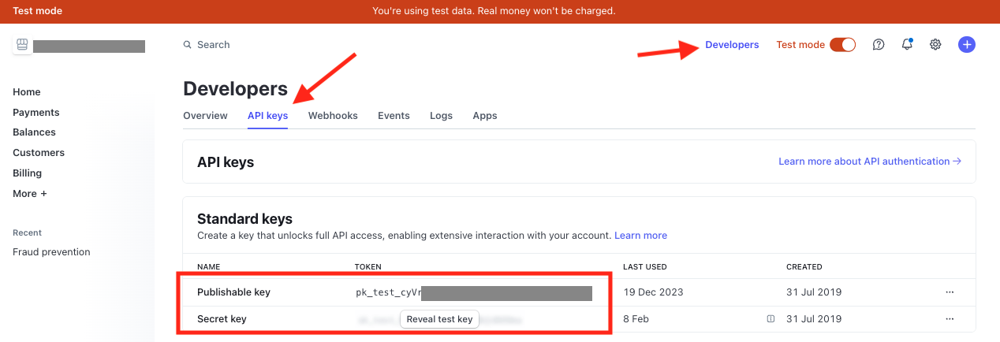

## Enable Stripe integration in Power Pages

1. Navigate to https://make.powerpages.microsoft.com/ and login using the credentials you created in the start of this lab or were provided with.
2. After login, make sure that you select the environment as you login name, e.g. **Crimson Canyon** for the user **crimson.canyon@powerlabs1.onmicrosoft.com**  
3. Click the **Get started** button and follow the prompts to create the Power Pages site:
* Select any option or **Skip** the first step
* Choose a website template (for this Lab recommended to choose the *Starter layout 1*, *Starter layout 2* or *Starter layout 3*) 
* Enter a unique name and domain for your site or leave the default values. Click **Done** to creat the site. 

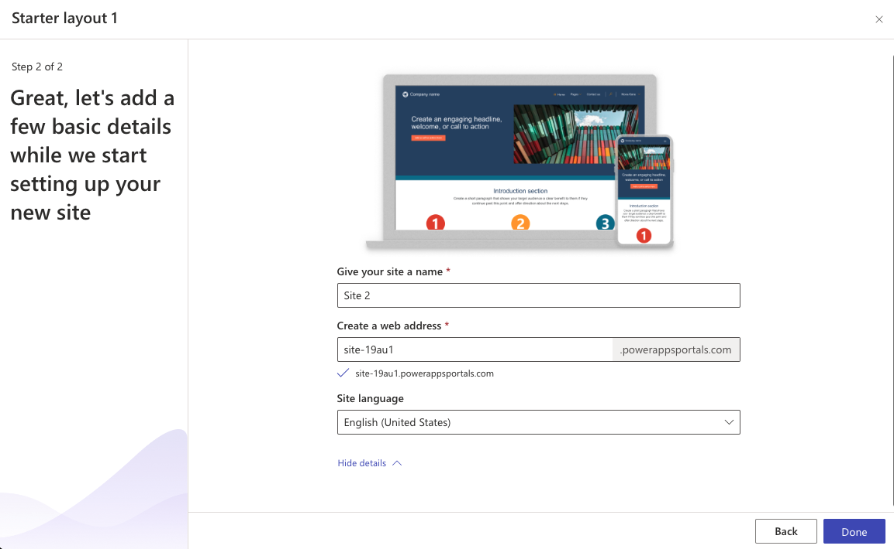

4. Once the creation of the site is finished, you will land in the Power Pages Studio.

5. In the Power Pages Studio select **Set up** section on the left panel and then find the **External apps (preview)** section.
6. You will see 2 integrations available - **DocuSign** and **Stripe**. We are interested in the latter today, so select **Install** in the **Stripe** row below. Click **Start installation** in the pop up dialog to confirm and wait until it completes. 

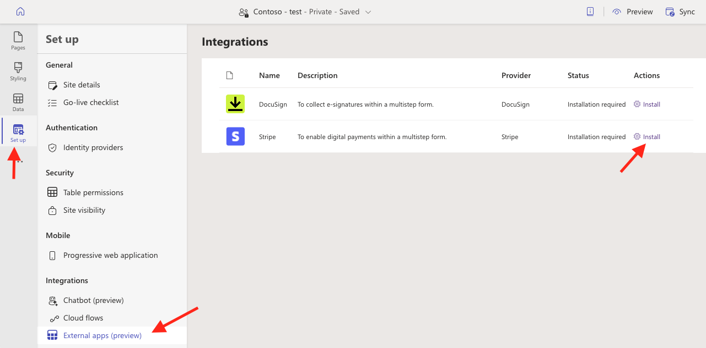

7. Once **Installing...** status turned into **Installed**, click **Manage** button and enter **Secret key** and **Publishable key** from the Stripe test account you created earlier. Click **Save** to save the changes.

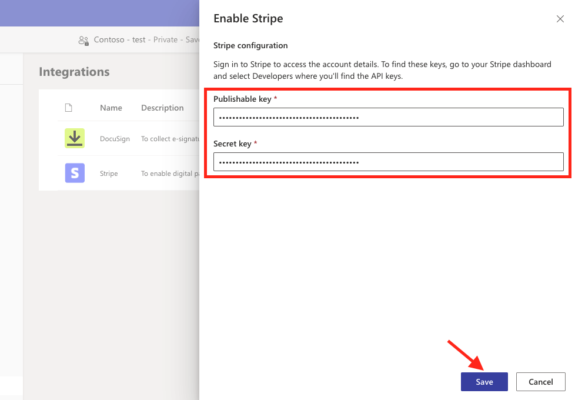

8. In the **Set up** scroll down teh page and in teh section **Admin actions** click **Open admin center**. In the new tab opened, in the **Site Action** menu at the top select **Restart site** action. 

## Create a pablisher and a solution (optional)

Completion of this section is not strictly required to make the lab work. However, this is the best practice to create new objects (in the next section) in solutions. 

1. Go to the Power Pages home and select **Solutions** section. Create there a new solution and name it **Power Pages Payments Lab** or similar. 

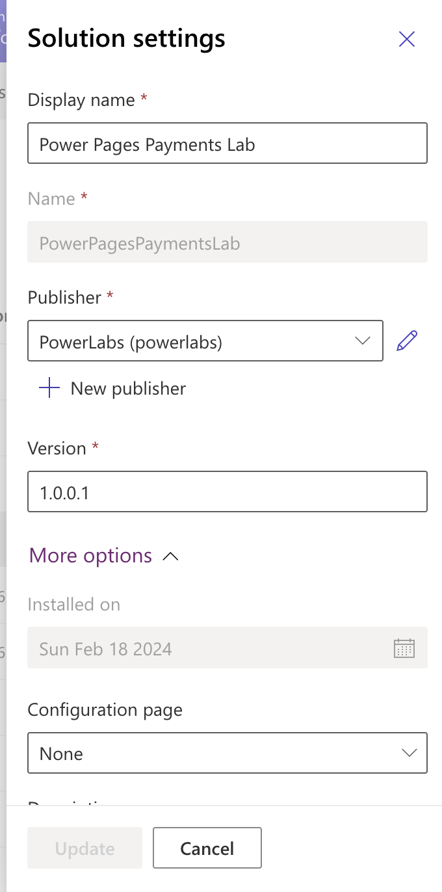

2. You will be required to select or create a publisher as well. Create a new publisher and call it like your environment name, e.g. **Amber Sunset** and select a prefix, e.g. **lab_**

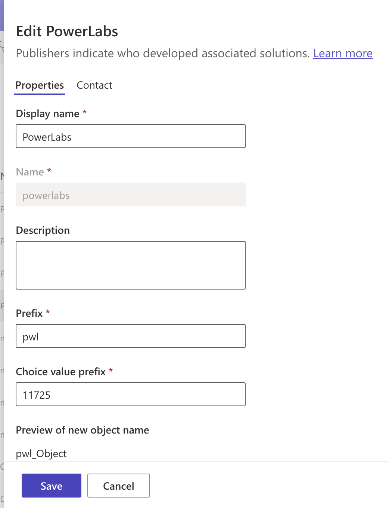

3. Return to the Power Pages Studio of your site, select **Data** section on the left panel and click on the cogs icon next to the **Data** header. Select a predefined solution **Power Pages Payments Lab**. This will ensure that the changes made in the next steps are associated with that Dataverse solution and not the Default solution.

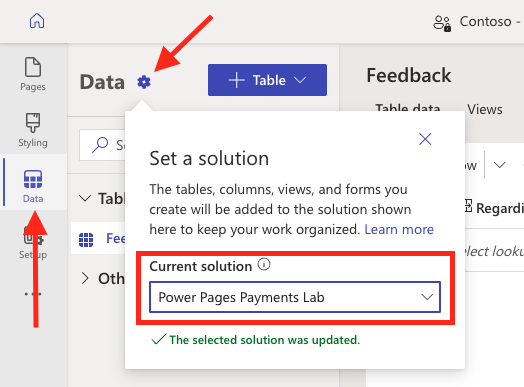

## Create a payment form 

1. Click **+ Table** button and select **New Table** to create a new table called **My Order** (or other name of your choice). Click **Save** to create the table. 

2. Select **New column** for the created table and add a new column with Display name **Amount** and of Data type **Currency**.

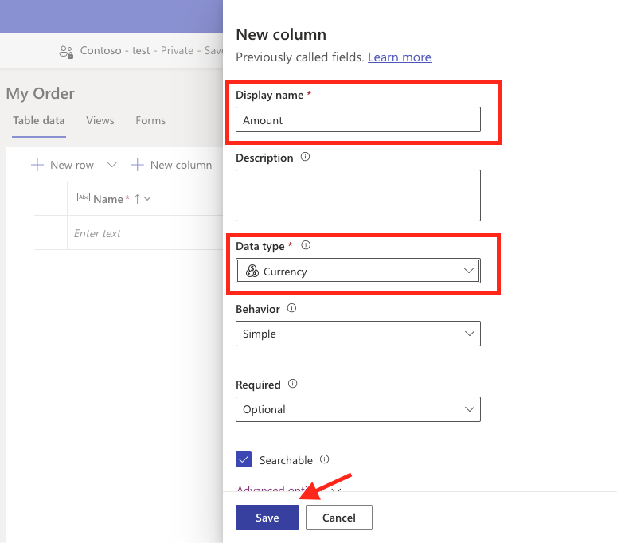

3. On the **Forms** tab find the default **Information** form, and edit it. Click **Add field** and select the column **Amount** to add it to the form. Hide the **Owner** column. Click **Save and publish** to save the form and then click **Back** to edit the table Payments.

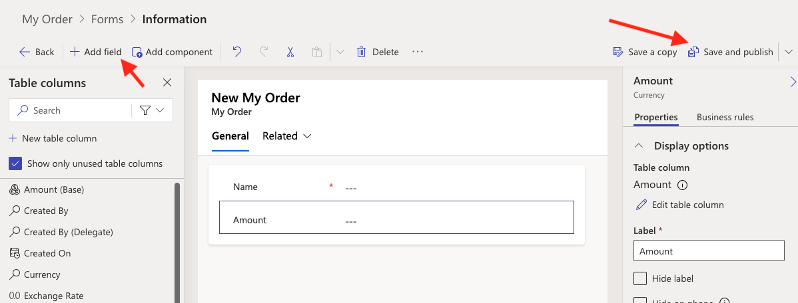

4. Click **New form** and add a new form called **Payment**. Click **Add field** and select the column **Amount** to add it to the form. Hide the **Name** and **Owner** columns. Click **Save and publish** to save the form and then click **Back** to edit the table Payments.

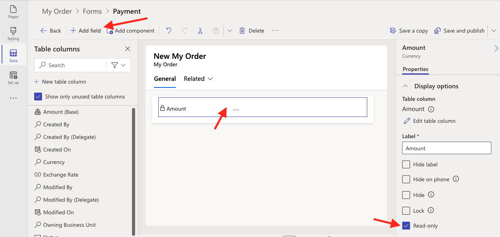

This is the form where Stripe control will be inserted automatically by Power Pages platform!

## Create a payment page

1. In the Power Pages Studio, click **Sync** button on the top right corner. This is necessary for the changes made in the previous section to take effect.
2. Select **Pages** section in Design Studio and click **+ Page** to create a brand new page. Name it **Checkout** or name of your choice. Leave the **Add page to main navigation** selected and click **Add**.  
3. On the new page select **Multistep form** component from the list of section components available. Name it **Checkout** or similar and click **Done** to save it.
4. On the added multistep component select **+ Add step** and set the step properties:
	* Step name: **Order details**
	* Choose a table: **My Order**
	* Select a form: **Information**
	* Data from this form: **Creates a new record** (in the **More options** section). 

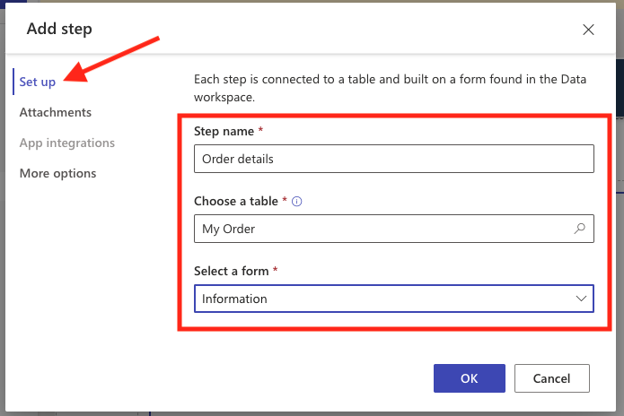

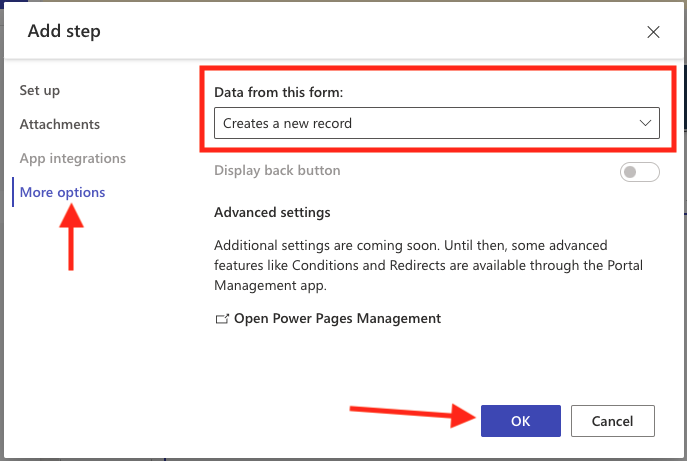

5. You may see a message **Set the permissions on this form**"with a button **New permission** available on the right. Click it and set the permission properties and save the record:
	* Permission to: **Create**, **Read**, **Update**
	* Roles: **Anonymous users** and **Authenticated users** are selected. 

*Please note, this lab is just a demo and doesn't authenticate users. In the real world scenario, you would need to remove "Anonymous users" from the permissions list. Leave it there for the purpose of this lab.*

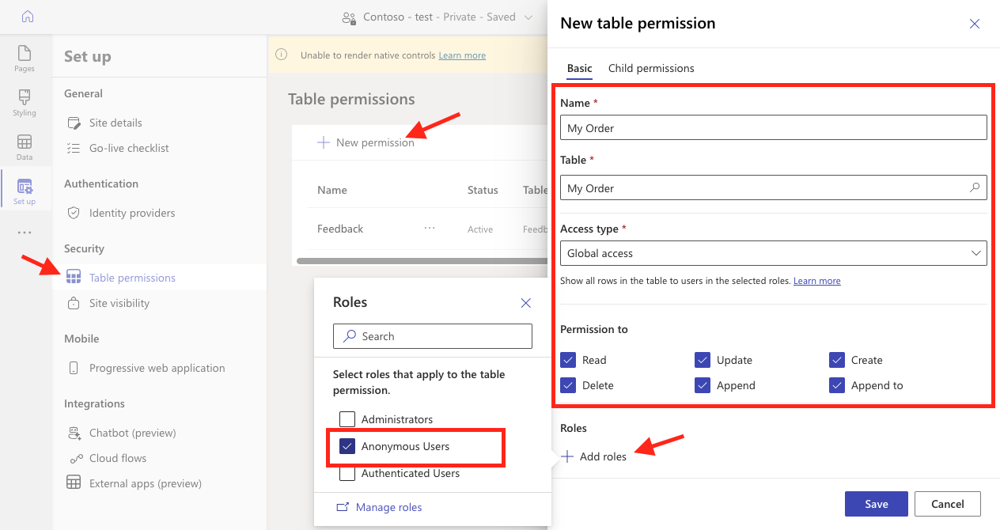

6. On the Multistep component select **+ Add step** to add another step and set the step properties and save the step:
	* Step name: **Payment**
	* Choose a table: **My Order**
	* Select a form: **Payment**
	* Data from this form: **Updates an existing record** (on the **More options** section).

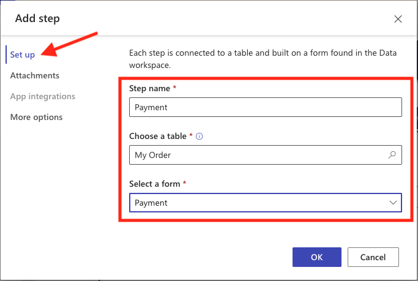

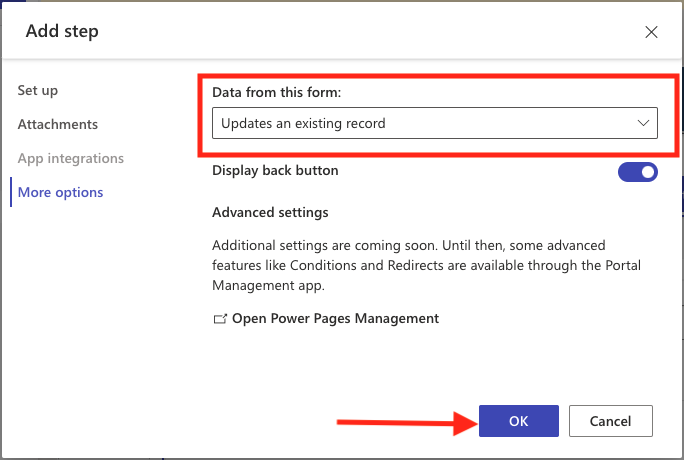

7. Open the step settings again and on the **App integrations** tab select **Enable digital payments**. In the **Choose amount field** select the **Amount** filed and click **OK**. 

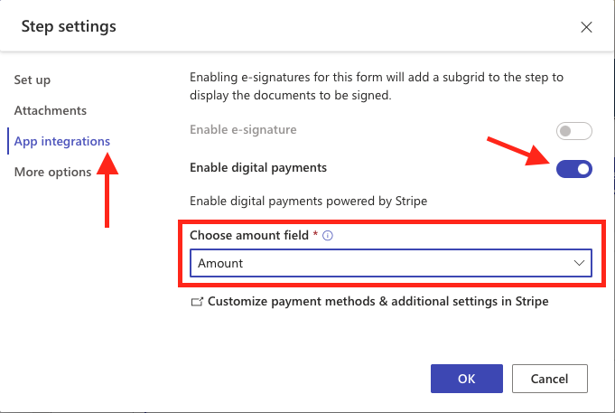

* If the **Enable digital payments** option is disabled, make sure that you've done step #1 (Sync). 
* If that was done and the option is still not available, you may need to return to https://make.powerpages.microsoft.com/  and click **Admin center** and restart the website. 
	 
8. Now you should see the Stripe credit card payments form appear on the newly created step, hooray! 

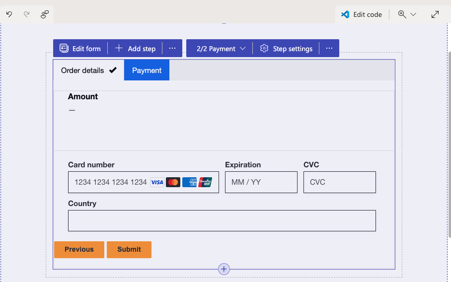

## Test the changes made

1. Click **Preview** button and then **Desktop** option to view the site preview in the new tab and navigate to the **Checkout** page.

*If you see the **You don't have the appropriate permissions.** message, make sure that you have completed the permissions setup steps for the My order table and have **Anonymous Users** role selected*

2. Enter test information to validate that the integration works end to end:
	* Name: **John Smith** or any string
	* Amount: **100**, or any amount greater than `0`
3. Click Next and enter the payment details. **Please do NOT enter the real card details!** While it will not create a charge, it's not a good practice for testing from the security point of view!
	* Card number `4242424242424242` (this is a test card number). 
	* Expiration: `01/30` (or any other future date)
	* CVC: `123` (or any 3 digit number)
	* Other details as required

 *If the page is displayed, but no Stripe form is rendered, go to **Set up** section, scroll down to **Admin actions**, select **Open admin center** link and then in the admin center on the top select **Site Actions** and **Restart site**. Wait for a minute or two and then try again previous step to access the payments page.*  

 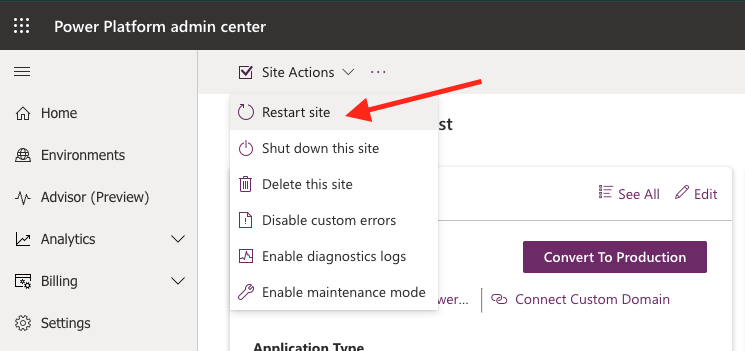

4. Click **Pay now** and in a second or few you should see a message *Your payment for ... was successfully processed. The transaction ID is ...*

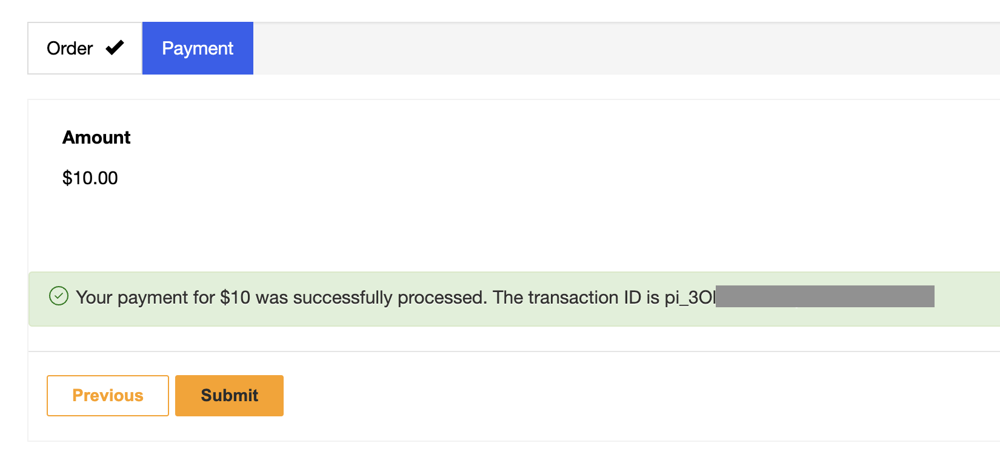

5. Navigate to you Stripe account (which still may be open in your browesr tab) and select **Payments** section on the left panel of the Stripe dashboard. You should see a successful payment created a few seconds ago with the amount you specified. 

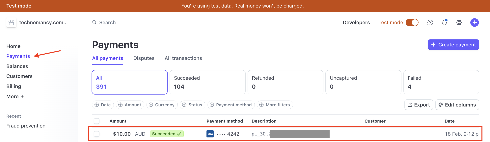

6. Click on the payment record and in the payment details page scroll down to the **Events and logs** section and examine the API request and responses and data that were initiated during this test. Note the pending Webhook requests! 

## Add failed payments handling (optional)

Follow the steps defined in the original article: https://cloudminded.blog/2024/01/09/how-to-improve-stripe-payments-in-power-pages/ 

